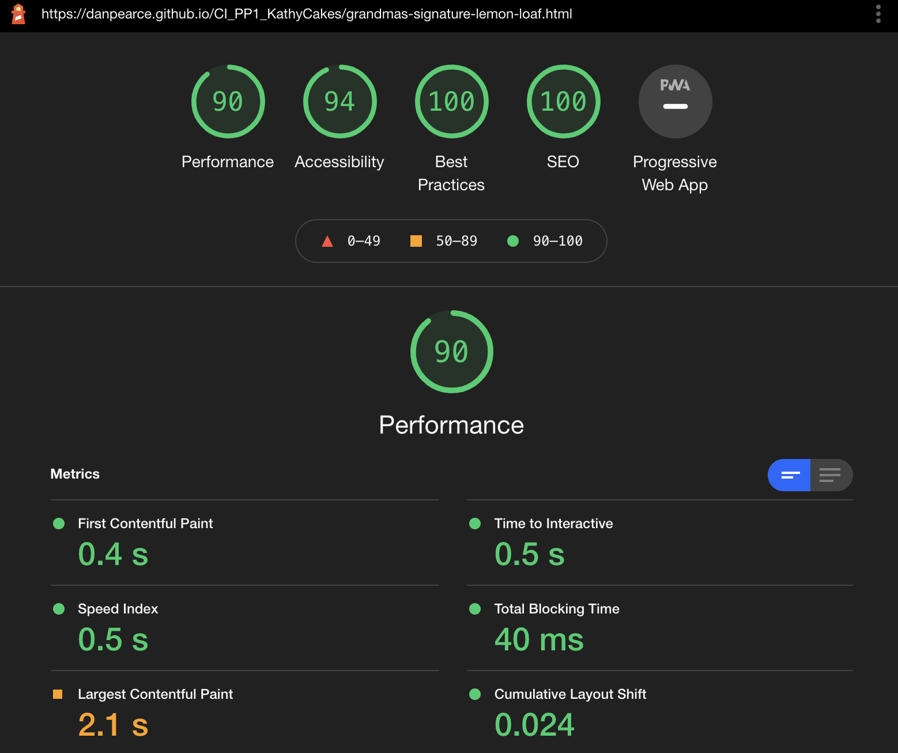

# KathyCakes - Bakery & Recipe Website
Developed by, Dan Pearce

[View the live site](https://danpearce.github.io/CI_PP1_KathyCakes/)

KathyCakes is a site that helps to encourage people to bake and create their own versions of the popular dishes from the KathyCakes Cafe. The website is intended to be a hub of information about the cafe and is here to help people get in touch with the cafe. The site offers a range of recipes too to help encourage people to try it at home themselves!

The site is designed with ease in mind and is easy to navigate for all ages. With use of high-quality images to showcase the cafe and with the end goal purpose of attracting more sales. 

## Content
1. [Site Goals and Customer Experience](#site-goals-and-customer-experience)
    - [Customer Goals](#customer-goals)
    - [Website Owner Goals](#website-owner-goals)
    - [Target Audience](#target-audience)
    - [Customer Expectations](#customer-expectations)
2. [User Stories](#user-stories)
    - [User](#user)
    - [Website Owner](#webiste-owner)
3. [Design](#design)
    - [Structure](#structure)
    - [Wireframes](#wireframes)
    - [Colour](#colour)
    - [Fonts](#fonts)
    - [Icons](#icons)
4. [Website Features](#website-features)
5. [Technologies](#technologies)
    - [Languages](#languages)
    - [Frameworks and Other](#frameworks-and-other)
6. [Validation and Testing](#validation-and-testing)
    - [HTML Validation](#html-validation)
    - [CSS Validation](#css-validation)
    - [Accessibility Validation](#accessibility-validation)
    - [Performance Validation](#performance-validation)
    - [Device and Browser Compatibility](#device-and-browser-compatibility)
    - [User Story Testing](#user-story-testing)
7. [Bugs and Errors](#bugs-and-errors)
8. [Deployment](#deployment)
9. [Credits](#credits)
    - [Images](#images)
    - [Recipes](#recipes)
    - [Code](#code)
10. [Acknowledgements](#acknowledgements)

## Site Goals and Customer Experience

### Customer Goals
- Easily find information about the bakery
- Easily find information on how to find the bakery.
- Get in touch with the bakery.

### Website Owner Goals
- Provide an alternative way to allow customers to get in touch.
- Provide a source of information about the bakery.
- Provide recipes for customers to try at home.
- Increase profits in store.
- Increase awareness about the bakery.

### Target Audience
- Regulars at the bakery.
- People who are looking to learn more about the bakery.
- People who are looking for new baking recipes.
- New customers who are looking to find the bakery.
- Customers looking to get in touch about an order/about placing an order.

### Customer Expectations
- Easy to navigate with a functioning navigational bar.
- Consistent design throughout, including design on all types of screen sizes.
- Fully functioning links, and no pages that lead to errors or dead links.
- Accessibility throughout the website.

## User Stories

### User
1. As a user, I want to easily find information about KathyCakes.
2. As a user, I want to easily navigate throughout the site.
3. As a user, I want to find information on how to find the bakery.
4. As a user, I want to find a way to get in contact with KathyCakes about an order.
5. As a user, I want to find a way to leave feedback to KathyCakes
6. As a user, I want to be able to find recipes that KathyCakes offers.
7. As a user, I want to find information about KathyCakes' social media.
8. As a user, I want to easily distinguish between different areas of information.

### Website Owner
9. As an owner, I want to showcase products on sale at the bakery.
10. As an owner, I want to provide customers with information about the bakery.
11. As an owner, I want customers to easily find our bakery.
12. As an owner, I want customers to be able to get in contact with us.
13. As an owner, I want to provide customers with the featured recipes of the season. 
14. As an owner, I want customers to be able to find all our recipes easily.
15. As an owner, I want customers to find out about how we started.

## Design 

### Structure
I wanted the structure of the site to be easy to navigate with clear headings and sections to split the pages up while also staying consistent with design. The website has a total of 11 pages 4 of which you always have access to using the navigation bar, 6 which are recipe pages and a 404 page.

#### Nav Bar Pages
These pages are what I would consider to be the 'most popular' pages, they include key information about the bakery.
- 'KathyCakes' index.html to provide about us information and featured recipes.
- recipes.html to provide a place to find all recipes featured on the site.
- find.html to provide a page to give location information for the bakery.
- contact.html to provide a page for customers to get in touch with KathyCakes.

#### Recipe Pages, Individual
The 6 individual recipe pages are each unique and provide information that is specifically for each recipe. They all include a detailed image and instructions on how to make each piece.

#### 404 Page
This page has been implemented to provide a fall back in case of input error to ensure the user can remain on the site easily.

### Wireframes

Home Page

Recipes Page

Individual Recipe Page's

Find Us Page

Contact Us Page

### Colour
The initial styling of colour comes from the header hero image of which the colour #3c4044 can be found amongst the background in some variation. I thought this would be a great colour to use as it's a charcoal grey which falls easily on the eyes. I also decided to go with #ecedf4 as the off white to counterbalance this colour. These two colours are used throughout the site and stay consistent with the theme. 

I used [WEBAIM.org](https://webaim.org/) to test the contrast of the two colours.

<section>Colour Contrast</section> 

### Fonts
I have used three fonts in the creation of this website, [Meow Script](https://fonts.google.com/specimen/Meow+Script) for the Logo, as this gives a more unique feel. [Montserrat](https://fonts.google.com/specimen/Montserrat) for the navigational sections in uppercase as this to me felt like it stood out. Finally, [Nunito](https://fonts.google.com/specimen/Nunito) was used for the main body sections as I felt this made the site easy to read and not too harsh on the eye.

### Icons
I used [favicon.io](https://favicon.io/) to create the favicon icons for the site with the [Meow Script](https://fonts.google.com/specimen/Meow+Script) font to stay consistent with styling. I also used icons from [Font Awesome](https://fontawesome.com/) to add the logos for social media networks in the footer.

## Website Features

### Navigation Bar & Footer
- The navigation and footer sections can be found on all pages. These are here for ease of access around the site and to always showcase social media sections.
- The nav bar is consistently placed at the top of the webpage for ease of access around the site. This is fixed into place no matter which page you visit!

User Stories Implementation: 2, 7, 8, 9

### Home About Us Section
- The Home/About Us Section is a key area to get information about the bakery.
- The section provides detail about how the bakery started, and features a baked good at the top of the page.
- The section is intended to provide users with some background so they can get familiar with the KathyCakes.

User Stories Implementation: 1, 10, 15

### Signature Recipes Section
- The Signature Recipes Section is here to highlight the bakery's featured recipes of the season.
- The section is featured on the index page and lets customers know which dishes we think they should try out!

User Stories Implementation: 8, 9, 13

### Recipes Page
- The Recipes Page is the hub for all of the recipes that is offered on the site.
- The page styles according to screen size and offers users a range to choose from.

User Stories Implementation: 6, 8, 9, 14

### Individual Recipe Page's
- The Individual Recipe Pages are all unique and there are six of them in total.
- The recipes are featured with their own unique hero image to really highlight the food on offer.
- These pages are designed with the user in mind to keep ingredients and instructions sectioned for ease of use.

User Stories Implementation: 8

### Map
- The Map allows us to pinpoint where the bakery is right on a map which is featured on the user's device.
- The Map is using the most popular online map in the world by Google and features the address for more old school customers.

User Stories Implementation: 3, 11

### Contact Form
- The Contact Form has been implemented as a way for customers to get in contact with KathyCakes with ease.
- The form can be used to enquire about orders or to leave feedback to the bakery. 

User Stories Implementation: 4, 5, 12

## Technologies

### Languages
- [HTML](https://en.wikipedia.org/wiki/HTML5)
- [CSS](https://en.wikipedia.org/wiki/CSS)

### Frameworks and Other
- [GitHub](https://github.com/)
- [GitPod](https://www.gitpod.io/)
- [Font Awesome](https://fontawesome.com/)
- [Balsamiq](https://balsamiq.com/)
- [Google Chrome Developer Tools](https://developers.google.com/web/tools/chrome-devtools)
- [Google Fonts](https://fonts.google.com/)
- [Favicon.io](https://favicon.io/)
- [Tiny PNG](https://tinypng.com/)

## Validation and Testing

### HTML Validation
All the HTML pages were tested using the [W3C Markup Validation Service] in order validate the correct function of this site. All pages have passed with no errors or warnings.

Home Page

Recipes Page

Apple & Cinnamon Crumble Cupcakes Page

Banana & Pumpkin Seeded Muffins Page

Chocolate Chip & Peanut Cookies Page

Grandma's Signature Lemon Loaf Page

Pink Grapefruit Muffins Page

Raspberry Twist Cupcakes Page

Find Us Page

Contact Us Page

### CSS Validation
The [W3C Jigsaw Validation Service](https://jigsaw.w3.org/css-validator/) was used to validate the correct CSS of this website. The CSS has passed with no errors

CSS

### Accessibility Validation
The [WAVE - Web Accessibility Evaluation Tool](https://wave.webaim.org/) was used to test the accessibility function of the website, all pages have passed with no errors.

Home Page

Recipes Page

Apple & Cinnamon Crumble Cupcakes Page

Banana & Pumpkin Seeded Muffins Page

Chocolate Chip & Peanut Cookies Page

Grandma's Signature Lemon Loaf Page

Pink Grapefruit Muffins Page

Raspberry Twist Cupcakes Page

Find Us Page

Contact Us Page

### Lighthouse
Lighthouse in the Google Chrome Developer Tools was used to test the performance of the website, most pages are awarded a green mark - with more time I would look into the issues on the two pages that didn't quite meet the green mark. I used [Tiny PNG](https://tinypng.com/) to help fix most of the issues on my initial performance results.

Index

Recipes

Find Us

Contact Us

Apple & Cinnamon Crumble Cupcakes

Chocolate Chip & Peanut Cookies

Grandma's Signature Lemon Loaf

Pink Grapefruit Muffins

Raspberry Twist Cupcakes

### Device and Browser Compatibility

#### Device Testing
The project was tested and viewed on numerous devices, all of which with no errors:
- iPhone 12 Pro
- Surface Pro 3
- MacbookPro 16-inch
- iPad Pro
- Tested on various sizes and screen types using Google Chrome Developer Tools

#### Browser Compatibility
The project was tested and viewed on the following browsers with no errors:
- [Google Chrome](https://en.wikipedia.org/wiki/Google_Chrome)
- [Mozilla Firefox](https://en.wikipedia.org/wiki/Firefox)
- [Microsoft Edge](https://en.wikipedia.org/wiki/Microsoft_Edge)
- [Apple Safari](https://en.wikipedia.org/wiki/Safari_(web_browser))

### User Story Testing
1. As a user, I want to easily find information about KathyCakes.
- Information about KathyCakes can easily be found right on the index.html page, either by scrolling down slightly depending on screen size or right on the landing page without movement.

User Story 1

2. As a user, I want to easily navigate throughout the site.
- The navigation bar is at the top of the website and is fixed into place, this is for ease of access on all web pages and all screen sizes.

User Story 2

3. As a user, I want to find information on how to find the bakery.
- The Find Us page is dedicated for users to find the bakery; this is located in the nav bar for easy access.

User Story 3

Result

4. As a user, I want to find a way to get in contact with KathyCakes about an order.
- The Contact Us Page is dedicated for users to contact the bakery, located on the nav bar, this can be used for orders.

User Story 4

Result

5. As a user, I want to find a way to leave feedback to KathyCakes
- The Contact Us Page is dedicated for users to contact the bakery; this can be used for customer feedback.

User Story 5

Result

6. As a user, I want to be able to find recipes that KathyCakes offers.
- The Recipes page is located on the navigation bar and provides a home page for all recipes on the site.

User Story 6

Result

7. As a user, I want to find information about KathyCakes' social media.
- Social Media links can be found in the footer of the website, this is on every page and uses icons of the logos of the social media sites for easily recognition.

User Story 7

8. As a user, I want to easily distinguish between different areas of information.
- Different information areas can be found in several places on the website, the most detailed is on the individual recipe pages which highlights and separates the ingredients and instructions sections. 

User Story 8

9. As an owner, I want to showcase products on sale at the bakery.
- All the images used are of products that are for sale in the bakery, this way highlighting them on all pages allows us to showcase them.

User Story 9

10. As an owner, I want to provide customers with information about the bakery.
- Information about the bakery can easily be found right on the index.html page, either by scrolling down slightly depending on screen size or right on the landing page without movement.

User Story 10

11. As an owner, I want customers to easily find our bakery.
- Information on where to find the bakery can easily be found by using the nav bar, and going to find us, this brings you to find.html which showcases a map, and details the address.

User Story 11

Result

12. As an owner, I want customers to be able to get in contact with us.
- The contact us page which can be found by using the nav bar and clicking contact us provides a form for customers to get in contact with the bakery.

User Story 12

Result

13. As an owner, I want to provide customers with the featured recipes of the season.
- Scrolling down the index.html page will bring you to the Signature Recipes section, where key highlighted recipes can be found. These are decided on the season, with Christmas being the latest theme! 

User Story 13

14. As an owner, I want customers to be able to find all our recipes easily.
- The recipes page located on the nav bar is always accessible and when clicked brings you to the page where all of the recipes are located.

User Story 14

Result

15. As an owner, I want customers to find out about how we started.
- On the index.html page, halfway through the about us section we can find information about how KathyCakes started. This information is easy to access as is right on the home page of the website. 

User Story 15

## Bugs and Errors

### HTML Bugs
#### Image Errors
- When I first ran the pages index.html and recipes.html through the validator the errors "Bad value 333px for attribute height on element img: Expected a digit but saw p instead." and "Bad value 500px for attribute width on element img: Expected a digit but saw p instead." were clear. This was because I didn't use styling within CSS for these elements. To fix this issue I simply added img {} to my CSS and styled accordingly.

HTML Error

- When I initially deployed the site for live viewing the header hero images were not showing on the site, this was because I had their sources set to "assets/css/images/xfilename.png", this obviously would create an error as we were already in the CSS file. To fix this I simply changed the source to "../images/xfilename.png".

- The 404-error page includes a image of Kath, this was initially called "Kath.jpeg", when deployed to the live site, it didn't load so I changed the file name to "kath.jpeg" so it was all lowercase.

#### Form Accessibility
- When initially running the contact.html page through the accessibility validator the were some errors due to a label being wrongly named in the email input section, to fix this I changed the label, and the page passed the test.

Form Error

## Deployment
This website was deployed using GitHub Pages by using the following steps:
1. I went to GitHub.com and from the left-hand side I clicked on this repository.
2. I navigated to the Settings section.
3. I scrolled down to the Pages section.
4. In the source drop down I selected main, and (root) and then clicked save.
5. This proceeds to generate a site using this repo.
6. I waited 10 minutes to allow the site to load, then after waiting a link appeared that brings us to the live site. 

## Credits

### Images
All stock images used:
- [StockSnap_DRMAQNM3XT.jpg](/assets/images/StockSnap_DRMAQNM3XT.jpg) by [Foodie Girl](https://stocksnap.io/author/foodiegirl) with [StockSnap](https://stocksnap.io/) [Image on External Site](https://stocksnap.io/photo/baked-muffins-DRMAQNM3XT)
- [StockSnap_EQRBUSHVRN.jpg](assets/images/StockSnap_EQRBUSHVRN.jpg) by [Foodie Girl](https://stocksnap.io/author/foodiegirl) with [StockSnap](https://stocksnap.io/) [Image on External Site](https://stocksnap.io/photo/slice-cake-EQRBUSHVRN)
- [StockSnap_OQFHR7KGN6.jpg](assets/images/StockSnap_OQFHR7KGN6.jpg) by [Foodie Girl](https://stocksnap.io/author/foodiegirl) with [StockSnap](https://stocksnap.io/) [Image on External Site](https://stocksnap.io/photo/cupcake-dessert-OQFHR7KGN6)
- [StockSnap_AVQS8DBY2Q.jpg](assets/images/StockSnap_AVQS8DBY2Q.jpg) by [Foodie Girl](https://stocksnap.io/author/foodiegirl) with [StockSnap](https://stocksnap.io/) [Image on External Site](https://stocksnap.io/photo/baked-cookies-AVQS8DBY2Q)
- [StockSnap_FQ5PQADGZ2.jpg](assets/images/StockSnap_FQ5PQADGZ2.jpg) by [Foodie Girl](https://stocksnap.io/author/foodiegirl) with [StockSnap](https://stocksnap.io/) [Image on External Site](https://stocksnap.io/photo/baked-muffins-FQ5PQADGZ2)
- [StockSnap_SVKREBA5TA.jpg](assets/images/StockSnap_SVKREBA5TA.jpg) by [Foodie Girl](https://stocksnap.io/author/foodiegirl) with [StockSnap](https://stocksnap.io/) [Image on External Site](https://stocksnap.io/photo/baked-food-SVKREBA5TA)
- [StockSnap_VG2DQ2RTYC.jpg](assets/images/StockSnap_VG2DQ2RTYC.jpg) by [Foodie Girl](https://stocksnap.io/author/foodiegirl) with [StockSnap](https://stocksnap.io/) [Image on External Site](https://stocksnap.io/photo/cupcake-dessert-VG2DQ2RTYC)
404 Error Page Image:
- [kath.png](assets/images/kath.png) provided by Kath, my good friend who this site is dedicated to - who does not wish her profile information to be made public. 

- [Tiny PNG](https://tinypng.com/) used to resize the images so they take less time to load.
### Recipes
All recipes were sourced from the internet, please find their references below:
- [Apple & Cinnamon Crumble Cupcakes](https://danpearce.github.io/CI_PP1_KathyCakes/apple-cinnamon-crumble-cupcakes.html) by [Manali](https://www.cookwithmanali.com/meetme/) with site [Cook With Manali](https://www.cookwithmanali.com/) find their recipe [here](https://www.cookwithmanali.com/apple-cinnamon-cupcakes/).
- [Raspberry Twist Cupcakes](https://danpearce.github.io/CI_PP1_KathyCakes/raspberry-twist-cupcakes.html) by [Erin](https://thefrozenbiscuit.com/about/) with site [The Frozen Biscuit](https://thefrozenbiscuit.com/) find their recipe [here](https://thefrozenbiscuit.com/raspberry-cupcakes/).
- [Grandma's Signature Lemon Loaf](https://danpearce.github.io/CI_PP1_KathyCakes/grandmas-signature-lemon-loaf.html) by [Emily Leary](https://www.amummytoo.co.uk/about-a-mummy-too/) with site [A Mummy Too](https://www.amummytoo.co.uk/) find their recipe [here](https://www.amummytoo.co.uk/the-worlds-best-lemon-drizzle-cake-recipe/).
- [Banana & Pumpkin Seeded Muffins](https://danpearce.github.io/CI_PP1_KathyCakes/banana-pumpkin-seeded-muffins.html) by [Olive Magazine](https://www.olivemagazine.com/) with site [Olive Magazine.com](https://www.olivemagazine.com/) find their recipe [here](https://www.olivemagazine.com/recipes/family/banana-and-pumpkin-seed-muffins/).
- [Chocolate Chip & Peanut Cookies](https://danpearce.github.io/CI_PP1_KathyCakes/chocolate-chip-peanut-cookies.html) by [Kristen Anderson](https://www.taste.com.au/recipes/choc-chip-peanut-biscuits/f2cb10d8-5554-461f-a268-18739f1ea0f4) with site [Taste.com.au](https://www.taste.com.au/) find their recipe [here](https://www.taste.com.au/recipes/choc-chip-peanut-biscuits/f2cb10d8-5554-461f-a268-18739f1ea0f4).
- [Pink Grapefruit Muffins](https://danpearce.github.io/CI_PP1_KathyCakes/pink-grapefruit-muffins.html) by [Kimberly Killebrew](https://www.daringgourmet.com/about/) with site [Daring Gourmet](https://www.daringgourmet.com/) find their recipe [here](https://www.daringgourmet.com/pink-grapefruit-buttermilk-muffins/).

### Code
- [HTML and CSS](https://www.htmlandcssbook.com/) by Jon Duckett - used to help me understand floats more clearly. 
- [Mimo](https://getmimo.com/) used to help me understand using flex in the nav bar.
- [GitHub](https://docs.github.com/en/pages/getting-started-with-github-pages/creating-a-custom-404-page-for-your-github-pages-site) used to help me create a 404.html page for my site. 
- [Code Academy](https://www.codecademy.com/) used to gain further knowledge in HTML and CSS.

## Acknowledgements
I would like to thank:
- Mo Shami, my mentor throughout this project who has provided me valuable information in many aspects.
- Anybody on Code Institute's Slack who have provided valuable details over the last few weeks.
- Katherine Slinn, who this website is built for, for letting me create a website in her name.
- To my dear partner, Harry, who has been my rock throughout building this site and has given me so much space where I needed it. 